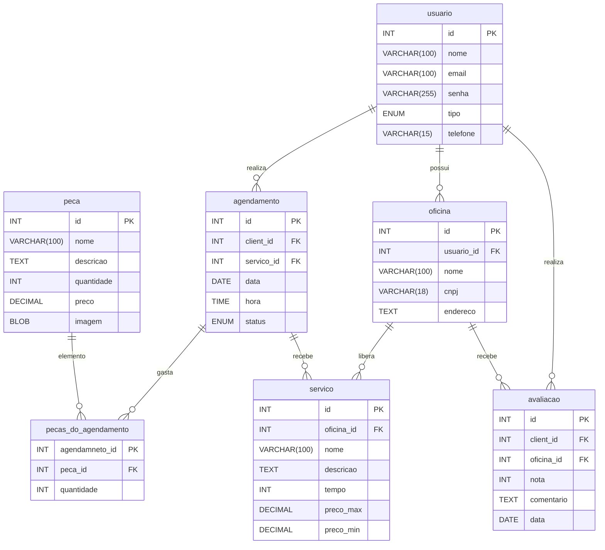

# Arquitetura

O projeto será construído em `node.js` com `react`, `expo` e com a modelagem **MVC**. Portanto, ele está separado em algumas partes que fazem a comunicação entre Models, Views e Controllers.

## Model

A camada _Model_ é sponsável por representar os dados e as regras de negócio da aplicação. Ela define a estutura da informação e contém a lógica necessária para manipular, validar e persistir esses dados, interagindo com um **banco de dados**. Nessa aplicação, os modelos são:

1. Usuário
2. Oficina
3. Serviço
4. Peça
5. Agendamento
6. Avaliação

Foi escolhido o banco de dados **PostgreSQL**, devido sua versalidade no armazenamento de dados em cojunto com **Docker**, fazendo a aplicação ser compartimentalizada de forma eficiente. As tabelas criadas são:

> As pastas dessa camada está separadas entre `/database` e `/models`

## View

_Expliquem o View ai PLS_

> As pastas dessa camada está separada em `/app, /assets, /components, e /styles`

## Controller

O controller atua como intermediáro entre _View_ e _Moedl_. Ee recebe as entradas do usuário enviadas pela _View_ (como comandos, ações ou dados de formulários), interpreta essas ações e decide como tratá-las. Isso geralmente envolve acessar ou alterar o Model, e depois escolher qual View deve ser renderizada em resposta.

> A pasta dessa camada está separada em `/controllers`
